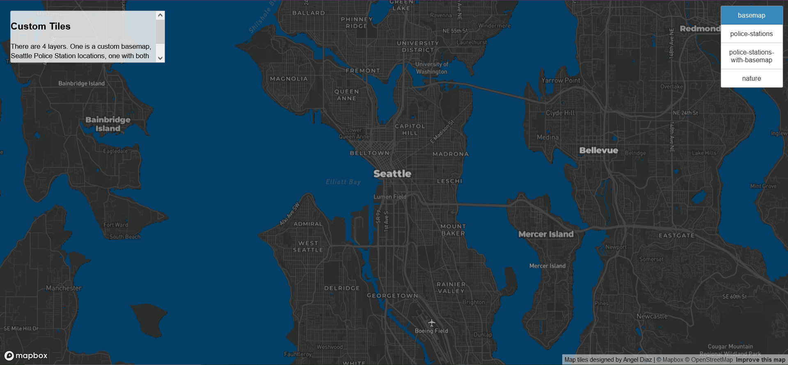
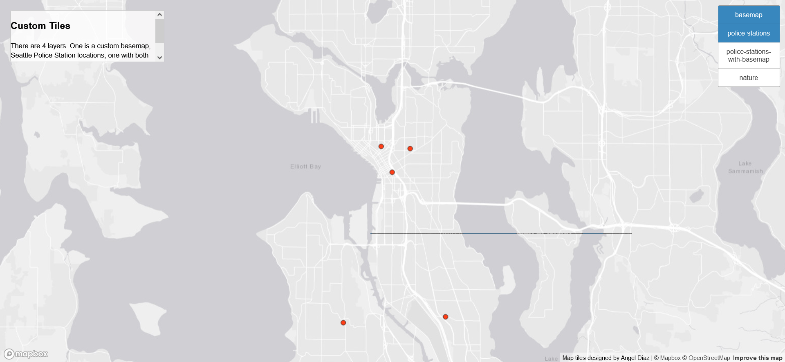
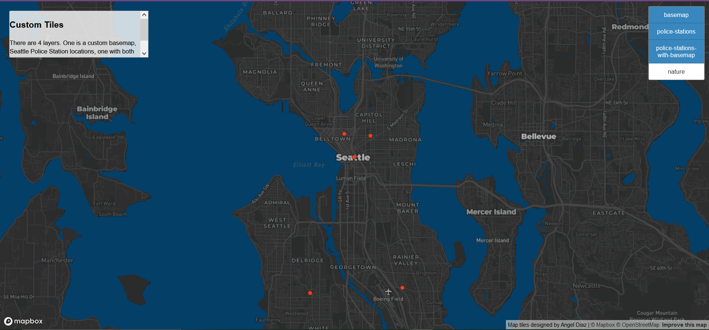
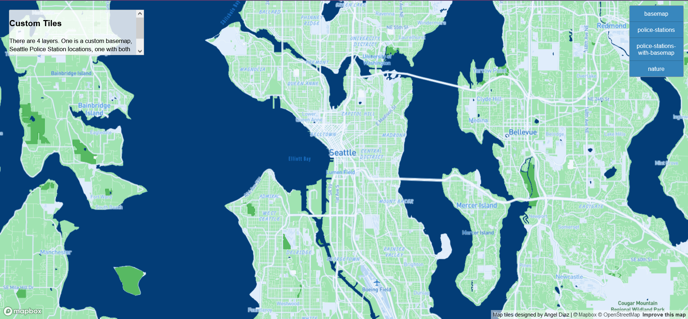

# Lab 4

    the url to access the web map you have made.
    screenshots of the four layers (2 POINTS)
    the examined geographic area, and (2 POINTS)
    the available zoom levels of each tile set (2 POINTS), and
    brief descriptions of each tile sets (3 POINTS).

## Map URL

[Web Map](https://diaza6.github.io/geog458-lab4/index.html)

## Modified Basemap

In these tiles, the available zoom levels are 1-14. This examines the Seattle
area. I made the basemap dark, changed some of the fonts, and made the water
a dark blue.

## Police Stations

In these tiles, the available zoom levels are 1-14. This examines the Seattle
area. It uses a light basemap and shows the locations of each police
station in the Seattle area. Each station is represented by a red dot.

## Modified Basemap + Police Stations

In these tiles, the available zoom levels are 1-14. This examines the Seattle
area. It overlays the police station locations over the modified basemap I created.

## Nature

In these tiles, the available zoom levels are 1-14. This examines the Seattle
area. The theme is nature so I made the basemap green, the water blue, changed the fonts
for nature areas, and made national parks a darker green.
